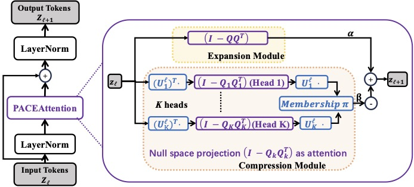

# PACENet
This repository includes the official implementation our paper “PACEAttention: Principled and Adaptive Feature Compression-Expansion Grounded in the Geometry of $\text{MCR}^2$”[ICML 2026, [paper link](https://openreview.net/forum?id=O64UziRDnr)]

Inspired by the **geometric interpretation** of the gradients of the maximal coding rate reduction ($\text{MCR}^2$) objective, we propose a principled and interpretable attention mechanism that facilitates feature compression and expansion.

# One layer of PACENet


<!-- # Reference
Please consider citing our work if you find it helpful to yours:
```
@inproceedings{
anonymous2026paceattention,
title={{PACEA}ttention: Principled and Adaptive Feature Compression-Expansion Grounded in the Geometry of \${\textbackslash}text\{{MCR}\}{\textasciicircum}2\$},
author={Anonymous},
booktitle={Forty-third International Conference on Machine Learning},
year={2026},
url={https://openreview.net/forum?id=O64UziRDnr}
}
``` -->